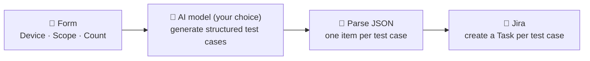
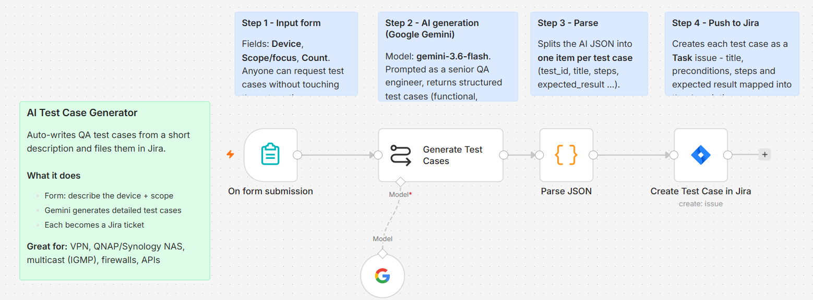

# AI Test Case Generator

Generate detailed QA test cases from a short description and push them straight into Jira — built as a self-hosted [n8n](https://n8n.io) workflow. **Bring your own LLM** (OpenAI, Anthropic, Google Gemini, Groq, OpenRouter — your choice) and your own API keys.

Writing test cases was never the hard part — **remembering all of them** was. This automation turns the enumeration work over to a model: you describe the feature, topology and build under test, and it expands that into a full set of structured test cases and files them as tickets. Deciding *what's worth testing* stays with you.

> Originally built for hardware & networking QA (VPN, QNAP/Synology NAS, multicast/IGMP), but it works for **any** kind of test-case generation.

---

## How it works

1. **Form** — you enter the *Device/Topic*, the *Scope* (feature, topology, build under test) and how many cases you want.
2. **AI model (your choice)** — prompted as a senior QA engineer, it returns test cases as strict JSON (covering functional, negative, boundary, security, performance and interoperability). Use any chat-model node you like — bring your own API key.
3. **Parse JSON** — a small code step splits the AI output into one item per test case (`test_id`, `title`, `category`, `priority`, `preconditions`, `steps`, `test_data`, `expected_result`).
4. **Jira** — each test case is created as a Task issue, with all details mapped into the description.

### Workflow diagram

---

## Who is this for?

- **QA / test engineers** who write repetitive test cases for hardware, networking, storage, APIs or web apps.
- **Product & platform teams** who want consistent, documented test coverage per feature or firmware build.
- **Anyone** who wants to skip the blank page and start from a solid first draft.

---

## Requirements

- A running **n8n** instance (self-hosted or cloud) — tested on n8n **2.35**.
- An **LLM API key** — **bring your own** from any provider n8n supports (OpenAI, Anthropic, Google Gemini, Groq, OpenRouter, and more). Use whichever model you prefer.
- A **Jira Cloud** account + **API token** — create one at [id.atlassian.com/manage-profile/security/api-tokens](https://id.atlassian.com/manage-profile/security/api-tokens).

> 🔐 Your keys live in **n8n's own encrypted Credentials store** — they are never part of this workflow file.

---

## Setup — use it with your own API keys

**1. Import the workflow**
- In n8n: **Workflows → Import from File** → choose [`workflow/ai-test-case-generator.json`](workflow/ai-test-case-generator.json).
  _(Or open the JSON, copy it, and paste directly onto the canvas.)_

**2. Add your credentials** (n8n → **Credentials → Add credential**)
- Your **LLM provider credential** → e.g. *OpenAI*, *Anthropic*, *Google Gemini(PaLM) API*, *Groq*, or *OpenRouter* — paste your own API key.
- **Jira SW Cloud API** → your Atlassian email + API token + domain (e.g. `https://your-org.atlassian.net`).

**3. Configure the nodes**
- **AI model node** → add (or swap in) the chat-model node for **your** provider (OpenAI / Anthropic / Google Gemini / Groq / OpenRouter …) — they all plug into the same *Generate Test Cases* step. Select your credential and pick a model.
- **Create Test Case in Jira** node → select your Jira credential, then choose your **Project** and **Issue Type** (e.g. `Task`).

**4. Run it**
- Click **Publish**, open the form's **Production URL**, fill in *Device / Scope / Count*, and submit.
- Watch results in the **Executions** tab, then check your Jira project for the new issues.

---

## Notes & gotchas

- **Choosing a model:** pick a fast, cost-effective model from your provider (most have a small "mini"/"flash" tier that's ideal here). If a model name is rejected, just select a current one your account has access to.
- **Jira free plan:** the free tier has no Xray/Zephyr "Test" issue type, so test cases are created as **Task** issues with the steps/expected result in the description. Upgrade later to remap to a dedicated Test type.
- **Privacy:** everything runs on your own n8n; your keys stay in n8n's credential store and nothing is exposed publicly unless you choose to.

---

## Try it on your own projects

This isn't limited to networking hardware. Point it at **whatever you test** — web apps, mobile apps, REST/GraphQL APIs, embedded devices, cloud infra, security controls. Describe the feature and scope in the form, plug in **your own API keys**, and let it draft the test cases while you focus on deciding *what's worth testing*.

**Fork it, make it yours, and use it in your own workflow.** Ideas, issues and contributions are welcome.

---

## Roadmap

- **v2 — Research step:** add live web research (e.g. Gemini Google-Search grounding or a search tool) so each test case is grounded in current device docs, protocols and known issues.
- **Alternative outputs:** Google Sheets, Excel, or TestRail instead of (or alongside) Jira.

---

## Author

**Nileshwari Kadgale**

## License

[MIT](LICENSE)
